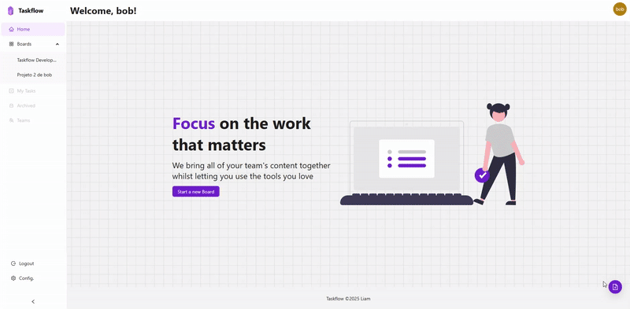

# 🧠 Taskflow



<p align="center">
  
  
  
  
  
  
  
</p>

**Taskflow** é uma aplicação **Fullstack** desenvolvida para o gerenciamento de tarefas e fluxos de trabalho, com foco em colaboração em equipe. A aplicação oferece autenticação segura com **JWT**, integra-se via **API REST** e **WebSocket**, e tem uma interface moderna construída com **Ant Design**.

O sistema é dividido em dois diretórios principais:

- 📦 `Server` → Backend construído com **NestJS** e **TypeORM**, com banco de dados **PostgreSQL** containerizado utilizando **Podman**.
- 🖥 `Client` → Frontend desenvolvido com **React 19**, **Ant Design 5**, e **Vite**.

### Funcionalidades principais:

- **Autenticação segura** usando **JWT** para garantir que apenas usuários autenticados possam acessar suas informações.
- **Hashing de senhas** com **Bcrypt**, protegendo as credenciais dos usuários com criptografia robusta.
- **API REST** para comunicação entre o frontend e o backend, permitindo operações de CRUD eficientes.
- **WebSocket** para permitir comunicação em tempo real entre os membros da equipe, sincronizando tarefas no **board** de maneira colaborativa.
- **Convidar usuários** para o **board**, possibilitando o trabalho em equipe e a gestão compartilhada de tarefas.
- **Banco de dados em container no Podman**, oferecendo um ambiente isolado e fácil de configurar para o PostgreSQL.
- **Interface moderna e responsiva**, utilizando componentes prontos do **Ant Design**, com personalizações de estilo e suporte a **Drag and Drop** para reordenar tarefas de forma intuitiva.
- **Uso de variáveis de ambiente** durante o desenvolvimento, garantindo flexibilidade e segurança na configuração de chaves, URLs e outras informações sensíveis.


---

## 📡 Comunicação em Tempo Real com WebSocket

A aplicação implementa **WebSocket** para permitir colaboração simultânea entre os membros de um board. Quando um usuário cria, edita ou movimenta uma tarefa, os outros usuários conectados ao mesmo board veem as mudanças **em tempo real**, garantindo sincronia no fluxo de trabalho.

---

## 📦 Tecnologias Utilizadas

### 🛠 Backend (`taskflow-api`)

- [NestJS](https://nestjs.com/) — framework Node.js para construir aplicações escaláveis  
- [TypeORM](https://typeorm.io/) — ORM para conexão com o banco de dados  
- [PostgreSQL](https://www.postgresql.org/) — banco de dados relacional  
- [Zod](https://zod.dev/) — validação e parsing de dados  
- [JWT](https://jwt.io/) — autenticação com tokens  
- [Bcrypt](https://github.com/kelektiv/node.bcrypt.js) — hash de senhas  
- [Swagger](https://swagger.io/) — documentação automática da API  
- [Socket.IO](https://socket.io/) — comunicação em tempo real via WebSocket  
- Outros utilitários: Helmet, Cookie Parser, Day.js, Config, etc.

---

#### 🐘 Banco de Dados com Podman

Nesse projeto eu utilizei o **Podman** em vez de Docker, você pode subir o container do PostgreSQL com o comando abaixo:

```bash
podman run -d \
  --name taskflow-db \
  -e POSTGRES_USER=admin \
  -e POSTGRES_PASSWORD=admin123 \
  -e POSTGRES_DB=taskflow \
  -p 5432:5432 \
  -v postgres_data:/var/lib/postgresql/data \
  docker.io/library/postgres:latest
```

### 🎨 Frontend (`Client`)

- [React 19](https://react.dev/)
- [Vite](https://vitejs.dev/)
- [Ant Design 5](https://ant.design/) — biblioteca de componentes UI
- [React Router v7](https://reactrouter.com/) — roteamento SPA
- [Axios](https://axios-http.com/) — chamadas HTTP com suporte a interceptadores
- [Socket.IO Client](https://socket.io/docs/v4/client-api/) — integração com WebSocket no frontend

---

## 📦 Ambiente de Desenvolvimento

---

## 🚀 Como Rodar Localmente

### 🐘 Pré-requisitos

- Node.js v18+
- Docker (ou Podman)
- Yarn ou NPM

---

### 🔧 Backend

#### 📁 Instalação

```bash
cd taskflow-api
npm install
```

#### ▶️ Rodar o servidor

```bash
npm run dev
```

#### 📄 Documentação da API

Após o servidor estar rodando, acesse:

```
http://localhost:3000/api
```

> Aqui está a documentação Swagger da API com todos os endpoints.

---

### 💻 Frontend

#### 📁 Instalação

```bash
cd client
npm install
```

#### ▶️ Iniciar o projeto

```bash
npm run dev
```

> A aplicação será acessível em `http://localhost:5173`.

---

## 📌 Observações

- Os dados sensíveis como senhas e JWTs são protegidos e validados com boas práticas de segurança.
- A API foi modularizada seguindo os princípios do NestJS, facilitando manutenção e escalabilidade.
- O frontend é responsivo e utiliza componentes prontos do Ant Design com customizações de estilo.
- A sincronização de tarefas entre os usuários conectados ao board é feita via **WebSocket**, promovendo um ambiente colaborativo em tempo real.

